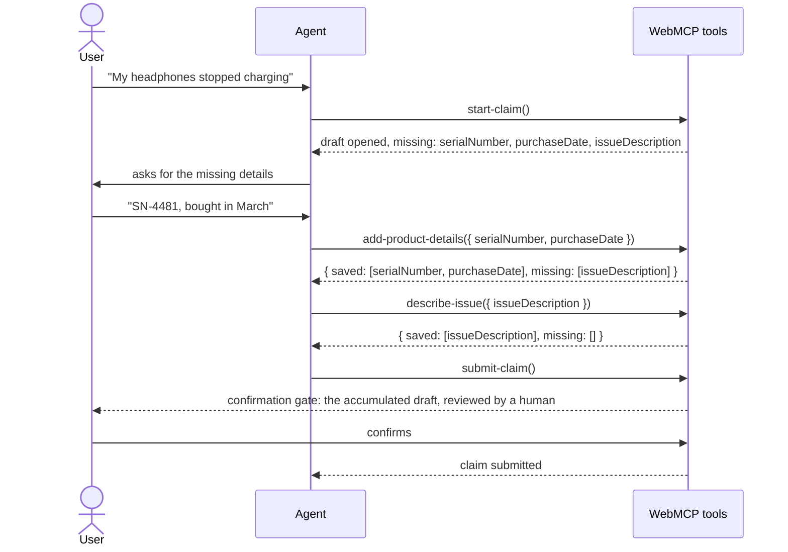

# Journeys: multi-step agent workflows with shared state

> The spec for the one thing tool generation alone cannot express: a user goal
> that takes several steps, where tools share state and one submission closes
> the flow.
>
> Depends on `docs/specs/generation-pipeline.md` (journeys are built from the
> tools that pipeline produces). Evidence:
> `docs/research/2026-09-02-chrome-webmcp-docs-analysis.md`.
>
> Status: shipped in 0.9, but in a different shape than this early spec. The
> config-declaration design below (a `journeys:` block) was never built.
> What ships: TypeScript files under the tools output's `journeys/` folder that
> import `createJourney` from the generator-owned `journey.webmcp.ts`, plus a
> `verify` lint over those files. Kept for decision history; treat the config
> block below as superseded.


## The problem

Users come to an agent with a goal, and goals range from small questions to
multi-step workflows. The codegen today generates one tool per action and
stops there. That covers the small questions. It cannot express the workflows:

- The article's warranty claim: `start_claim_process` →
  `populate_product_details` → `describe_issue` → `populate_contact_info` →
  one submission.
- The catering inquiry: reception details, dietary restrictions (one call per
  restriction group), a drink package, then one submission.
- The wishlist pattern from the shopping journeys: stage items, review,
  commit.

All three are the same shape: **ordered steps accumulate into a draft, and a
final step submits it.** One concept covers all three. That concept is the
journey, and it is the hardest feature in this stack to get right, because the
hard part is not the machinery. It is correctly defining the journey itself,
which takes an understanding of the product that no CLI can infer.


## What we do about the hard part

Chrome's build-tools doc gives the method: define the user goal (the outcome,
the required context, the boundaries, what matters most), define the initial
state (application state, agent context, system constraints), then role-play
the conversation turn by turn to discover which tools each step needs. Evals
and production telemetry close the loop.

Our answer is not to automate that thinking. It is to make the result of that
thinking cheap to declare, cheap to verify, and cheap to replay:

- **Declaration is one config block** (below).
- **The audit verifies the declaration against reality**: every step must name
  a tool that exists, every `fills` field must be a real input of that tool,
  and a journey with no submit step is an error.
- **The dashboard replays the journey** the way an agent would run it, so the
  developer can role-play the conversation against their own tools without
  needing an agent in the loop.
- **A docs page, "Design your tools around a journey"**, walks the CUJ method
  onto the codegen workflow: pick one journey, generate, review, test, ship.
  It ships with the pipeline (docs-only, Phase 1), ahead of the feature.


## Declared, not detected

Inferring journeys from spec paths (`POST /claims`, `POST /claims/{id}/items`,
`POST /claims/{id}/submit`) is fragile magic, and the wrong inference is worse
than none. Journeys are declared in config:

```js
// codegen.config.mjs
export default defineConfig({
  sources: [openapi({ spec: "./openapi.yaml" })],
  outputs: [tools({ outDir: "./src/webmcp" })],
  journeys: [
    {
      name: "warranty-claim",
      steps: [
        { tool: "start-claim" },
        { tool: "add-product-details", fills: ["serialNumber", "purchaseDate"] },
        { tool: "describe-issue", fills: ["issueDescription"] },
        { tool: "submit-claim", submits: true },
      ],
    },
  ],
});
```

Each step names a tool the pipeline already generated (or scaffolds one when
the spec has no matching endpoint), and `fills` declares which draft fields
the step is responsible for.


## What gets generated

One file per journey, `warranty-claim.journey.ts`, alongside the tool files:

- **A draft store**: a module-level object the step tools read and write.
  Memory-only in v1; sessionStorage persistence waits until someone asks.
- **One tool per step**, registered like any other generated tool. Each step
  merges its input into the draft and returns
  `{ saved: [...fields], missing: [...fields] }`. The `missing` list is the
  article's "the agent asks the user for more information" loop, expressed as
  a tool result the agent can act on without guessing.
- **The submit step**: its input schema is derived from the union of every
  step's `fills`. Called with an incomplete draft, it returns `isError` with
  the missing fields listed. Called with a complete draft, it runs the
  confirmation gate (it is a write, so the gate is non-negotiable, same as any
  mutation) with the accumulated draft rendered into the confirm message, then
  executes.

Additivity note: the catering example calls `add_dietary_restrictions` once
per restriction group. Step tools that fill list-valued fields append rather
than replace. This falls out of the draft model naturally; it just needs to be
the written-down behavior.

Everything generated is ordinary code in the user's repo: readable, ownable,
no new runtime dependency. Same contract as the tool files.


## What the developer sees: the journey, visualized

A declared journey is enough information to draw the whole flow. Two surfaces:

**A generated sequence diagram.** The dashboard renders one mermaid sequence
diagram per journey, derived from the declaration plus each tool's inputs and
results. For the warranty claim:



This answers "what will the agent actually do with my site" with a picture
instead of a reading exercise, and it costs us almost nothing: the
declaration is the diagram's data.

**A way to run it.** The dashboard gains "run a journey": pick a declared
journey, execute the steps in order, edit inputs between steps, inspect each
result. This is the role-playing step of the build-tools method, run against
real generated tools instead of imagined ones. Exporting a run as a CI test
file waits for the design doc's mock-agent test module.

The diagram and the runner ship together with the feature: the declaration
gives both their script for free.


## What journeys deliberately are not

- Not a routing or navigation system. The article's `start_claim_process`
  "navigates to the correct form"; whether a step should navigate the page is
  an app concern. Default: app code (see open questions).
- Not a new runtime dependency. The draft store is generated code in the
  user's repo.
- Not automatic. Detection from specs is a follow-up with a named trigger:
  declaration proves painful in practice.


## Open questions

- **Journey drafts**: memory-only vs sessionStorage. Memory-only v1.
- **Navigate steps**: does a journey step ever generate page navigation, or is
  that always app code? Default app code.
- **The `navigate` side effect** exists in the design doc's `SideEffect` type
  but not in code. Journeys are where it would first matter.


## Naming

Journeys use the article's own words: a `journey` (critical user journey) has
`steps`, steps `fills` fields of a `draft`, and the last step `submits`. One
concept, one name.


## Ships with

- This feature (Phase 2, after the generation pipeline's 0.5): the journey
  declaration and generated files, the audit rules, the dashboard sequence
  diagram, and "run a journey".
- `examples/shop`: search, order history, a wishlist journey, checkout. It is
  the vertical example that demonstrates journeys, so it lands with them.
- (`examples/timesheet-form` and `examples/apartments` demonstrate the
  pipeline's form output and search patterns; they land with the pipeline.)


## What success looks like

A developer with a warranty-claim flow on their site should be able to rebuild
the article's own example, start to finish, in under an hour: generate the
tools from their spec (or annotate their form), declare the journey, watch the
audit pass catch their thin descriptions, see the whole flow as a sequence
diagram, replay it in the dashboard as if they were Charlie's agent, and ship
it knowing a human confirms the final submission. If they can do that without
reading our source code, the stack is doing its job.
