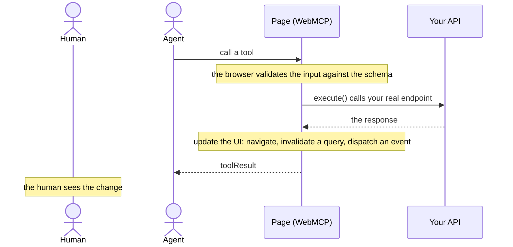

When an agent calls one of your tools, a person is usually watching the page. If the call
changes something and the screen does not move, the person sees nothing happen, and the two
experiences of your app drift apart: the agent's and the human's.

So a tool's job is not finished when the request succeeds. It is finished when the page
reflects it. One step in the call is easy to forget, because nothing fails when you skip it:



## The pattern

Update the same UI your human flow would have updated:

```ts
export async function executeCreateTrip(input: CreateTripInput, signal?: AbortSignal) {
  const data = await callApi("/v1/trips", { method: "POST", body: JSON.stringify(input) });

  // Make the effect visible:
  await queryClient.invalidateQueries({ queryKey: ["trips"] });
  router.push(`/me/${data.trip.id}`);

  return toolResult(data);
}
```

Navigate, invalidate a query, dispatch an event: whatever your UI already does when the
person clicks the button. The tool should drive your product, not route around it.

## Where it goes

Every generated endpoint tool ends its `execute()` with a marked spot for this:

```ts
  const data = await callApi(`/pets`, { method: "POST", ... });
  // Make the effect visible: an agent acts while a human watches this
  // page. If this call changes what is on screen, update the UI here
  // (navigate, invalidate a query, dispatch an event).
  return toolResult(data);
```

The comment sits below the end-of-generated marker, in the part of the file you own, so
whatever you write there survives regeneration.

Not every tool changes the screen. A pure lookup can leave the page alone. The question to
ask per tool is simple: if the person clicked this themselves, what would they see change?
Do that.
